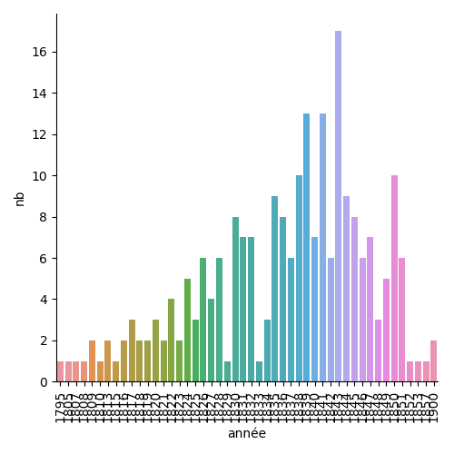

# Tout savoir des communard·e·s de Wikidata
Présentation à partir des éléments de Wikidata à propos des personnes qui ont fait la Commune de Paris 1871. 

Fait par Gabriel-le avec les éléments connues dans wikidata le 9 mars 2022.
- autaire : Gabriel-le
- date de création du script : 9 mars 2022, 
- dernière version : 11 mars 2022 

- rapport généré le : 11/3/2022 à 18h37 
## Méthodologie 

Wikidata est une base de données libre, liée à Wikipédia. Son remplissage est fait de façon collaborative. 

Ce document est fait à partir des éléments s'y trouvants le 11/3/2022 à 18h37. 

Sont pris en compte toutes les personne dont le champs 'occupation' (P21) comprends la valeur 'communard' (Q1780490)'.
## Liste des personnes étudiées
Simple liste des 236 personnes avec leur appellation d'usage dans wikidata. Par ordre alphabétique de l'item, le prénom le plus souvent.

Achille Ballière, Adolf Rozwadowski, Adolphe Assi, Adolphe Clémence, Adrien Lejeune, Adèle Esquiros, Adélaïde Valentin, Albert Regnard, Albert Theisz, Alexandre Girault, Alexis Louis Trinquet, Alfred-Édouard Billioray, Alix Payen, Alphonse Humbert, Alphonse Lonclas, Amilcare Cipriani, Amélie Payen, André Bastelica, André Léo, André Slomszynski, Angelina Courcelles, Anna Pustowójtówna, Anne-Marie Ménand, Antoine Demay, Antonin Desfarges, Aristide Claris, Armand Antoine Jules Arnaud, Armand Félix Marie Jobbé-Duval, Arthur, Arthur Ranc, Auguste Adolphe Okolowicz, Auguste Blanqui, Auguste Durassier, Auguste Serraillier, Auguste Sicard, Auguste Viard, Auguste-Jean-Marie Vermorel, Augustin Avrial, Augustin Verdure, Baptiste Descamps, Benjamin Barré, Benoît Malon, Blanche Lefebvre, Blanche de Corbie, Béatrix Excoffon, Camille Bias, Camille Langevin, Charles Amouroux, Charles Beslay, Charles Delescluze, Charles Ferdinand Gambon, Charles Gérardin, Charles Ledroit, Charles Longuet, Charles Lullier, Charles Élie Ducoudray, Claude Dominique Napias, Claude Payet, Claude-Jules Duruof, Clovis Dupont, Clériot, Constant Marie, Constantin Kawecki, Coralie Chérelle, Céleste Hardouin, Dominique Régère, Edgar Monteil, Edmond-Alfred Goupy, Elisabeth Javelin, Eliska Vincent, Emmanuel Chauvière, Ernest Granger, Ernest Puget, Eugenio Defendi, Eugène Gérardin, Eugène Pottier, Eugène Protot, Eugène Razoua, Eugène Varlin, Eugène Vermersch, Eugénie Boulanger, Eugénie Chilly, Eulalie Papavoine, Florence Baruteau, Florence Van de Walle, Fornarina de Fonseca, Fortuné Henry, François Edmond Rattier, François Jourde, François-Charles Ostyn, François-Louis Parisel, Frédéric Cournet, Félix Pyat, Gabriel Ranvier, Galdric Verdaguer, Gaston Da Costa, Gaston Save, Georges Arnold, Georges Cavalier, Giovanni Defendi, Gustave Courbet, Gustave Flourens, Gustave Lefrançais, Gustave Maroteau, Gustave Paul Cluseret, Gustave Tridon, Henri Brissac, Henri Chouteau, Henri Mortier, Henri Payen, Henri Ranvier, Henri Rochefort, Henri Rochefort, Henry Bauër, Henry Louis Champy, Herminie Cadolle, Hortense David, Hortense Machu, Hubert Geresme, Jacques Louis Durand, Jarosław Dombrowski, Jean Allemane, Jean Baptiste Clément, Jean Charles Rouchy, Jean-Baptiste Chardon, Jean-Baptiste Noro, Jean-Jacques Pillot, Jean-Louis Pindy, Jean-Martial-Aminthe Dupont, Joseph Charlemont, Joséphine Marchais, Joséphine Michel Bocquin, Jules Allix, Jules Andrieu, Jules Bergeret, Jules Fontaine, Jules Honoré Vinot, Jules Joffrin, Jules Martelet, Jules Miot, Jules Montels, Jules Vallès, Jules-Ferdinand Baulard, Jules-Nicolas-André Babick, Jules-Paul Johannard, Julie Magot, Julien Fruneau, Kswaiera Ladojska Kawecka, Laure Boulant, Lise Bourette, Louis Rossel, Louis-Augustin Rogeard, Louis-Charles Maljournal, Louis-Denis Chalain, Louis-Guillaume Debock, Louis-Simon Dereure, Louise Bonenfant, Louise Bonnehaut, Louise Boutin, Louise Laffitte, Louise Michel, Louise Neckbecker, Louise Talbot, Lucie Bocquin, Lucie Maris, Lucien Henry, Lucienne Prins, Léo Frankel, Léo Melliet, Léontine Suétens, Marc-Amédée Gromier, Marguerite Lachaise, Marie Catherine Rogissart, Marie Christine Dargent, Marie Ferré, Marie La Cécilia, Marie Lecourt, Marie Manière, Marie Mercier, Marie-Jeanne Moussu, María Pantazí, Maurice Garreau, Maurice Garreau, Maxime Lisbonne, Maxime Vuillaume, Mina Puccinelli, Napoléon Gaillard, Napoléon La Cécilia, Nathalie Lemel, Noémi Reclus, Olivier Souêtre, Paschal Grousset, Paul Antoine Brunel, Paul Ferrat, Paul Martine, Paul Milliet, Paul Philémon Rastoul, Paule Minck, Philéas Félix Bermond, Pierre Bourgeois, Pierre Denis, Pierre Laffitte, Pierre Vésinier, Pilotell, Père Tanguy, Raoul Rigault, Raoul Urbain, Reine Cottin, Robert Caze, Sofia Kovalevskaïa, Sophie Poirier, Stanislas Xavier Pourille, Théophile Ferré, Tony Moilin, Ulysse Parent, Valentin Bouteilhe, Victoire Tinayre, Victor Clément, Victor Pilhes, Victor Renou, Victorine Brocher, Victorine Eudes, Victorine Gorget, Walery Wroblewski, colonel Delorme, sœurs Clémence, Édouard Moreau, Édouard Vaillant, Élisabeth Dmitrieff, Élisabeth Rétiffe, Élisée Reclus, Émile Eudes, Émile Léopold Clément, Émile Oudet, Émile-Victor Duval, Émilie Noro
## Répartition par genre
Dans wikidata, on peut remplir le 'sexe ou genre' (P21) pour les personnes. Certaines personnes peuvent ne pas avoir ce champs renseigné.
                    Voyons comment se répartissent selon leur genre les communard·e·s ayant une fiche dans wikidata.
Sur 236, il y a 69 femmes, 165 hommes, et 2 personne dont le genre n'est pas renseigné ou autre

## Répartition par année de naissance
Dans wikidata, on peut remplir la 'date de naissance' (P569) pour les personnes. Certaines personnes peuvent ne pas avoir ce champs renseigné.
                    Voyons comment se répartissent selon leur naissance, donc âge les communard·e·s ayant une fiche dans wikidata.

## D'où viennent les communard·e·s
Dans wikidata, on peut remplir le 'lieu_de_naissance' (P19) pour les personnes. Certaines personnes peuvent ne pas avoir ce champs renseigné. 

le plus souvent il s'agit d'une ville, mais al peut y avoir un arrondissement, pays... 

Comptons par lieux combien de communard·e·s (ayant une fiche dans wikidata) y sont né·e·s. 
 Trie par nombre descoissant de personne et ordre inverse de l'alphabet
|Ville de naissance|Nombre de personne| 
 |---|---| 
|Paris|36| 
|Bordeaux|5| 
|Tours|4| 
|Vierzon|3| 
|Lyon|3| 
|Lille|3| 
|Reims|2| 
|Poitiers|2| 
|Nîmes|2| 
|Le Mans|2| 
|Issoudun|2| 
|Chartres|2| 
|Brest|2| 
|Bastia|2| 
|5e arrondissement de Paris|2| 
|http://www.wikidata.org/.well-known/genid/8e5877e6412ebc87fc17ddc1e9570200|1| 
|http://www.wikidata.org/.well-known/genid/292d283267c3b9e29b349d9cca6d4ffa|1| 
|ancien 9e arrondissement de Paris|1| 
|Vézelise|1| 
|Vroncourt-la-Côte|1| 
|Vire|1| 
|Vilnius|1| 
|Vendeuvre-sur-Barse|1| 
|Vaux-Lavalette|1| 
|Valenciennes|1| 
|Troyes|1| 
|Troissy|1| 
|Thézan-lès-Béziers|1| 
|Tarascon-sur-Ariège|1| 
|Suresnes|1| 
|Stare Wierzchowiska|1| 
|Souvigny|1| 
|Sisteron|1| 
|Scye|1| 
|Sauveterre-de-Comminges|1| 
|Sannerville|1| 
|Salins-les-Bains|1| 
|Sainte-Foy-la-Grande|1| 
|Saint-Thomas-de-Conac|1| 
|Saint-Séglin|1| 
|Saint-Pierre-le-Bost|1| 
|Saint-Louis|1| 
|Saint-Dié-des-Vosges|1| 
|Saint-Cloud|1| 
|Saint-Brieuc|1| 
|Saint-Brice-Courcelles|1| 
|Saclas|1| 
|Roye|1| 
|Roubaix|1| 
|Roncey|1| 
|Romilly-sur-Seine|1| 
|Revel|1| 
|Remilly-Wirquin|1| 
|Raïon de Toropets|1| 
|Pézenas|1| 
|Péronne|1| 
|Puget-Théniers|1| 
|Puceul|1| 
|Précieux|1| 
|Pologne|1| 
|Poligny|1| 
|Plédran|1| 
|Plourin-lès-Morlaix|1| 
|Ornans|1| 
|Neuve-Maison|1| 
|Neufmanil|1| 
|Naples|1| 
|Nangis|1| 
|Mézières-en-Drouais|1| 
|Mâcon|1| 
|Moscou|1| 
|Mortagne-au-Perche|1| 
|Montmerle-sur-Saône|1| 
|Mirecourt|1| 
|Mende|1| 
|Meaux|1| 
|Mayenne|1| 
|Marey-sur-Tille|1| 
|Lévignac-de-Guyenne|1| 
|Lusignan|1| 
|Lesdain|1| 
|Lectoure|1| 
|Le Puy-en-Velay|1| 
|Le Plessis-Dorin|1| 
|Lay-Saint-Christophe|1| 
|Lapalisse|1| 
|Laigneville|1| 
|Lachapelle-aux-Pots|1| 
|La Guillotière|1| 
|La Charité-sur-Loire|1| 
|Jytomyr|1| 
|Justine-Herbigny|1| 
|Jaloudok|1| 
|Issoire|1| 
|Gignac|1| 
|Gap|1| 
|Gand|1| 
|Fontenay-le-Comte|1| 
|Figeac|1| 
|Figanières|1| 
|Elbląg|1| 
|Dreux|1| 
|Dole|1| 
|Dinan|1| 
|Denicé|1| 
|Damery|1| 
|Crastes|1| 
|Cosne-Cours-sur-Loire|1| 
|Corte|1| 
|Condé-sur-Noireau|1| 
|Clermont-Ferrand|1| 
|Claye-Souilly|1| 
|Clamart|1| 
|Châtillon-sur-Seine|1| 
|Châtellerault|1| 
|Château-Gontier|1| 
|Choisel|1| 
|Cherbourg|1| 
|Chassagne-Montrachet|1| 
|Chalmoux|1| 
|Chalabre|1| 
|Casalmaggiore|1| 
|Carisey|1| 
|Carhaix-Plouguer|1| 
|Calais|1| 
|Caen|1| 
|Buda|1| 
|Bréhémont|1| 
|Bourges|1| 
|Bourg-en-Bresse|1| 
|Boulogne-sur-Mer|1| 
|Boulogne-Billancourt|1| 
|Bouleternère|1| 
|Blois|1| 
|Blanquefort-sur-Briolance|1| 
|Bernay|1| 
|Berghem|1| 
|Berchem|1| 
|Beauvais|1| 
|Beaune|1| 
|Beaumont-de-Lomagne|1| 
|Beaugency|1| 
|Baugy|1| 
|Bagnolet|1| 
|Auxerre|1| 
|Autun|1| 
|Anzio|1| 
|Angers|1| 
|Albi|1| 

